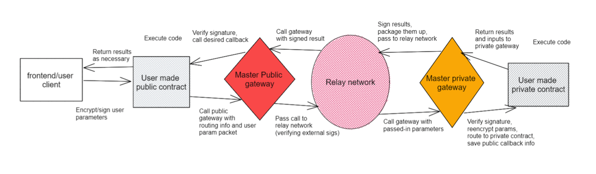

## TNLS Architecture


## Ethereum Contracts

You will need a copy of [Foundry](https://github.com/foundry-rs/foundry) installed before proceeding. See the [installation guide](https://github.com/foundry-rs/foundry#installation) for details.

To build the contracts:

```sh
git clone https://github.com/Atbash-Labs/TNLS.git
cd public-gateway
forge install 
```

### Run Tests

In order to run unit tests, run: 

```sh
forge test
```