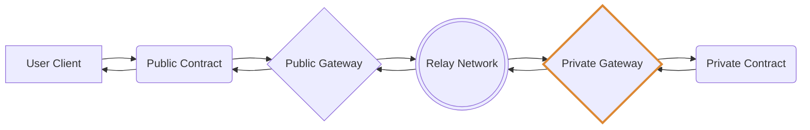

# TNLS-gateways



## Private Gateway Interfaces

```rust
pub struct PreExecutionMsg {
    /// Task ID coming from the relayer.
    pub task_id: u64,
    /// Handle to be called at destination contract.
    pub handle: String,
    /// Destination contract address and code hash.
    pub routing_info: Contract,
    /// Encryption of (data, routing info, and sender info).
    pub payload: Binary,
    /// Unique random bytes used to encrypt payload.
    pub nonce: Binary,
    /// Hash of encrypted input values.
    pub payload_hash: Binary,
    /// Signature of hash of unencrypted input values.
    pub payload_signature: Binary,
    /// User verification key / public chain address.
    pub sender_info: Sender,
}

pub struct Contract {
    /// Contract address.
    pub address: HumanAddr,
    /// Contract code hash.
    pub hash: String,
}

pub struct Sender {
    /// User public chain address.
    pub address: HumanAddr,
    /// User verification key.
    pub public_key: Binary,
}
```

Before encryption / after decryption:
```rust
pub struct Payload {
    /// Input values as JSON formatted string.
    pub data: String,
    /// Destination contract on private network.
    pub routing_info: Contract,
    /// User verification key / public chain address.
    pub sender: Sender,
}
```
